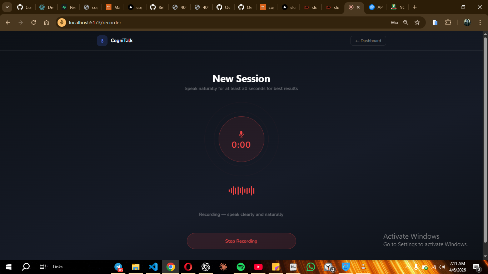

# CogniTalk 🎙️

> AI-powered speech coaching that helps you speak with clarity, confidence, and impact.

CogniTalk records your speech, transcribes it with OpenAI Whisper, and delivers instant coaching feedback — clarity scores, pace analysis, filler word detection, and personalized suggestions — all in a clean, modern interface.

---

## ✨ Features

- 🎤 **In-browser recording** — one-click audio capture, no installs needed
- 📝 **AI transcription** — powered by OpenAI Whisper for accurate speech-to-text
- 🧠 **Smart analysis** — GPT-4o scores your clarity, detects filler words, and gives actionable coaching tips
- 📊 **Session history** — track your progress across every recording
- 🔐 **Auth** — secure login and signup via Supabase (email + Google OAuth)
- 💳 **Subscriptions** — Paystack-powered free and pro tiers *(coming soon)*

---

## 🖥️ Tech Stack

**Frontend**


**Backend**


**Infrastructure**


---

## 📸 Screenshots

> Dashboard · Recorder · Results

<!-- Add screenshots here once deployed -->
| Dashboard | Recorder | Results |
|-----------|----------|---------|
|  |  |  |

---

## 🚀 Getting Started

### Prerequisites

- Node.js 18+
- An [OpenAI](https://platform.openai.com) account with API credits
- A [Supabase](https://supabase.com) project

### 1. Clone the repo

```bash
git clone https://github.com/waynemandem/cognitalk.git
cd cognitalk
```

### 2. Set up the frontend

```bash
cd client
npm install
```

Create `client/.env`:

```env
VITE_SUPABASE_URL=https://your-project.supabase.co
VITE_SUPABASE_ANON_KEY=your-anon-key
```

### 3. Set up the backend

```bash
cd server
npm install
```

Create `server/.env`:

```env
OPENAI_API_KEY=sk-...
SUPABASE_URL=https://your-project.supabase.co
SUPABASE_SERVICE_ROLE_KEY=your-service-role-key
PORT=3001
```

### 4. Set up the database

Run the following in your Supabase **SQL Editor**:

```sql
create table sessions (
  id uuid default gen_random_uuid() primary key,
  user_id uuid references auth.users(id) on delete cascade not null,
  duration_seconds integer not null,
  created_at timestamptz default now()
);

create table speech_reports (
  id uuid default gen_random_uuid() primary key,
  session_id uuid references sessions(id) on delete cascade not null,
  transcript text,
  word_count integer,
  clarity_score numeric,
  pace_wpm integer,
  filler_count integer,
  filler_words jsonb default '{}',
  suggestions jsonb default '[]',
  created_at timestamptz default now()
);

alter table sessions enable row level security;
alter table speech_reports enable row level security;

create policy "Users see own sessions" on sessions
  for all using (auth.uid() = user_id);

create policy "Users see own reports" on speech_reports
  for all using (
    session_id in (select id from sessions where user_id = auth.uid())
  );
```

### 5. Run the app

In two separate terminals:

```bash
# Terminal 1 — frontend
cd client && npm run dev

# Terminal 2 — backend
cd server && npm run dev
```

Visit `http://localhost:5173`

---

## 🗂️ Project Structure

```
cognitalk/
├── client/                  # React + Vite frontend
│   ├── src/
│   │   ├── pages/           # Login, Signup, Dashboard, Recorder
│   │   ├── hooks/           # useAudioRecorder
│   │   └── services/        # Supabase client
│   └── vite.config.js
│
└── server/                  # Node.js + Express backend
    ├── routes/
    │   └── analyze.js       # POST /api/analyze
    ├── services/
    │   ├── transcribe.js    # Whisper API
    │   └── analyzeSpeech.js # GPT-4o analysis
    └── server.js
```

---

## 🛣️ Roadmap

- [x] Audio recording with MediaRecorder API
- [x] Whisper transcription
- [x] GPT-4o speech analysis
- [x] Session history saved to Supabase
- [x] Dark mode UI
- [ ] Session history page
- [ ] Paystack subscription tiers
- [ ] Azure pronunciation scoring
- [ ] ElevenLabs voice playback for model pronunciation
- [ ] Mobile app (React Native)

---

## 👨‍💻 Author

**Joseph Okoemu** — self-taught frontend developer based in Nigeria, building real products to reach job-readiness.

- GitHub: [@waynemandem](https://github.com/waynemandem)
- Portfolio: [josephportf.netlify.app](https://josephportf.netlify.app)
- YouTube: [@zerotowebhero_01](https://youtube.com/@zerotowebhero_01)

---

## 📄 License

MIT
